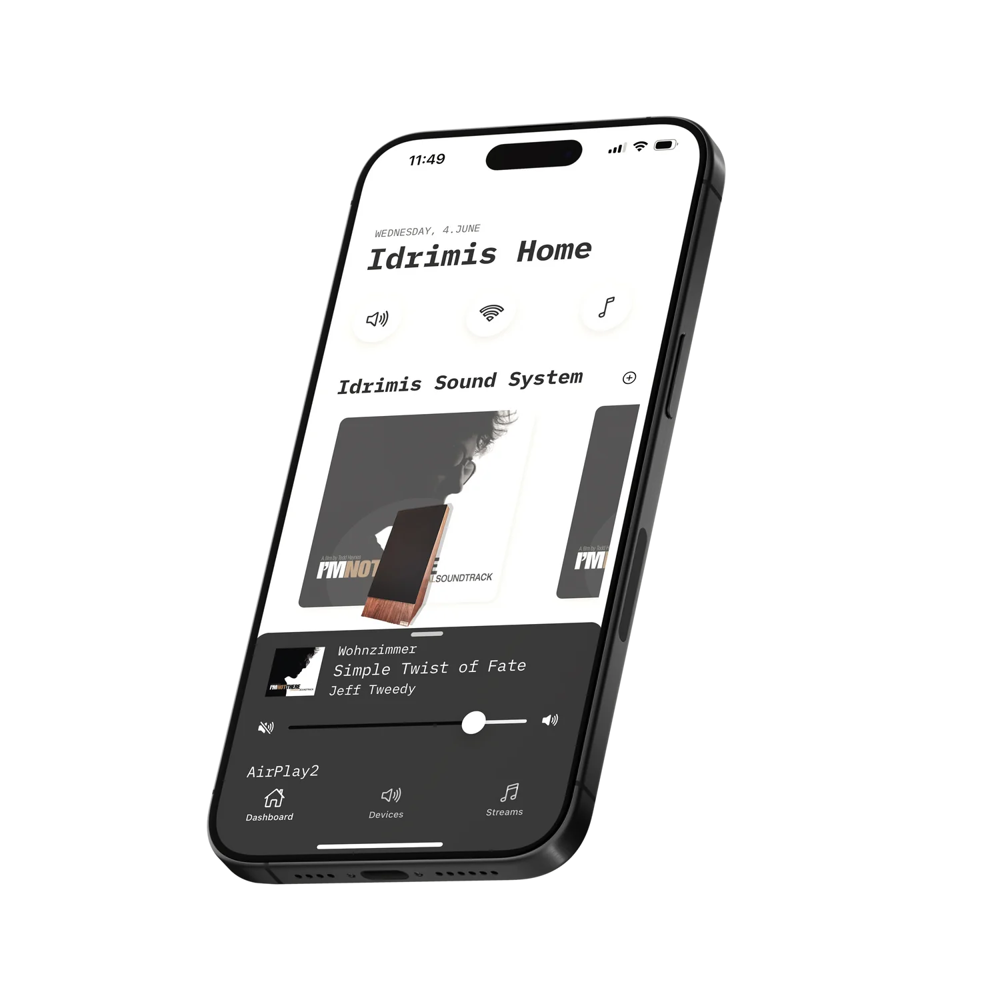

# Beatnik Controller



Beatnik Controller is a web-based remote control for your [Snapcast](https://github.com/badaix/snapcast) multi-room audio server. It allows you to easily manage and control audio streams from any device with a web browser. The application can also be compiled for Android and iOS.

## Features

-   Control volume for all connected clients.
-   Manage client groups.
-   View what's currently playing on each stream.
-   Simple and intuitive user interface.

## Prerequisites

To run Beatnik Controller, you will need:

-   A running Snapcast server on your network. This application is compatible with the standard [Snapcast server](https://github.com/badaix/snapcast). For a detailed installation guide for a Raspberry Pi based setup, we recommend [beatnik-pi](https://github.com/byrdsandbytes/beatnik-pi).
-   [Docker](https://www.docker.com/get-started) and [Docker Compose](https://docs.docker.com/compose/install/).

## Installation & Usage

Getting started with Beatnik Controller is simple with Docker.

### 1. Get the Code

Clone this repository to your local machine:

```bash
git clone https://github.com/byrdsandbytes/beatnik-controller.git
cd beatnik-controller
```

### 2. Configure the Snapcast Server (Optional)

By default, the application will try to connect to a Snapcast server at `beatnik-server.local`. If your server is at a different address, you can configure it in two ways:

-   **During Setup (Optional):** Edit `src/environments/environment.prod.ts` and change `snapcastServerUrl` to your server's hostname or IP address.
-   **In-App Settings:** Once the application is running, you can go to the settings page and change the Snapcast server address directly in the user interface.

### 3. Run with Docker

Once configured, you can build and run the application using Docker Compose:

```bash
docker compose up -d
```

This will build the Docker image and start the application in the background.

### 4. Access the Application

Open your web browser and navigate to `http://localhost:8181` or `http://your-hostname.local:8181`. You should now see the Beatnik Controller interface.

## Contributing

If you are a developer and want to contribute to the project, build mobile apps, or run the application in a development environment, please see our [CONTRIBUTING.md](CONTRIBUTING.md) file for more information.

## License

This project is licensed under the AGPL v3 License - see the [LICENSE](LICENSE) file for details.

